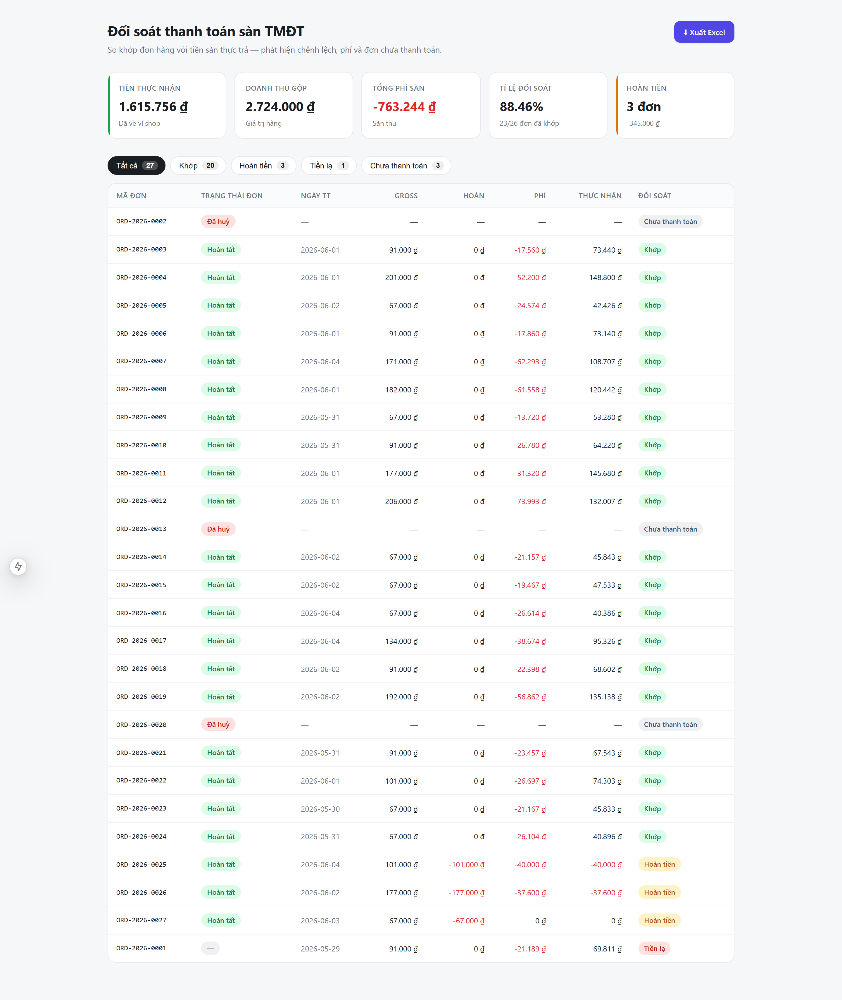

# Mini Reconciliation Dashboard

Đối soát đơn hàng của shop (`orders.csv`) với file thanh toán sàn TMĐT (`income.csv`): phân loại từng đơn, tính KPI và phát hiện chênh lệch. Backend **FastAPI + PostgreSQL**, frontend **Next.js 15**.



## Tính năng

- Đối soát mỗi đơn thành 4 trạng thái: `matched` / `refunded` / `orphan` / `unsettled`.
- API KPI: tổng doanh thu, tiền thực nhận, phí, hoàn tiền, tỉ lệ đối soát.
- Dashboard: thẻ KPI + bảng lọc theo trạng thái + xuất Excel.
- Xử lý dữ liệu bẩn: dòng thanh toán trùng, đơn mồ côi, hoàn tiền âm.

## Stack & yêu cầu

| | |
|---|---|
| Backend | FastAPI (Python 3.12), psycopg3 |
| Database | PostgreSQL 16 |
| Frontend | Next.js 15, TypeScript |
| Migration | Goose (up/down) |
| Hạ tầng | Docker Compose |

**Cần có:** Docker Desktop, Node.js 20. *(Không cần cài Python/Postgres — chạy trong container.)*

## Chạy

**1. Backend + Database**
```bash
docker compose up -d db                                 # PostgreSQL
docker compose run --rm backend goose up                # tạo schema
docker compose run --rm backend python -m scripts.seed  # nạp orders.csv + income.csv
docker compose up -d backend                            # API tại http://localhost:8000
```

**2. Frontend**
```bash
cd frontend
cp .env.example .env.local
npm install && npm run dev                              # http://localhost:3000
```

**3. Test**
```bash
docker compose run --rm backend pytest -q               # 14 passed
```

## Mô hình đối soát

`net_received = gross_revenue + refund_amount + fee_total` (hoàn tiền & phí là số âm).

| Trạng thái | Ý nghĩa |
|---|---|
| `matched` | Đơn có thanh toán, không hoàn tiền — thu đủ |
| `refunded` | Đơn có thanh toán kèm hoàn tiền (`refund_amount < 0`) |
| `orphan` | Có dòng thanh toán nhưng không tìm thấy đơn trong sổ |
| `unsettled` | Đơn tồn tại nhưng sàn chưa thanh toán (gồm đơn đã huỷ) |

## API

| Endpoint | Mô tả |
|---|---|
| `GET /reconciliation[?status=]` | Danh sách đơn kèm `reconcile_status`, lọc theo trạng thái |
| `GET /kpi` | `total_gross, total_net, total_fees, reconciliation_rate, refund_count, refund_total` |
| `GET /reconciliation/export[?status=]` | Xuất Excel (sheet KPI + chi tiết) |
| `GET /health` | Health check |

Định dạng response: `{ data, meta }` (list) · `{ data }` (single) · `{ error: { code, message } }` (lỗi).

## Quyết định thiết kế

- **Tiền là số nguyên VND** (`BIGINT` / `int`), không dùng float → tránh sai số làm tròn.
- **Khử trùng 2 lớp**: ràng buộc `UNIQUE` ở DB + `ON CONFLICT DO NOTHING` khi import, và một lần nữa trong tầng nghiệp vụ → dòng thanh toán trùng lặp không bị cộng đôi.
- **Không đặt khóa ngoại** `income → orders`: cho phép lưu đơn mồ côi (thanh toán không khớp đơn nào) thay vì chặn insert và mất dữ liệu cần đối soát.
- **Tách lớp**: logic đối soát thuần (không phụ thuộc DB/web) → unit-test trực tiếp, không cần dựng database.
- Phân loại dựa trên **dữ liệu thanh toán**; trường `status` của đơn dùng để hiển thị.

## Làm việc với AI (có kiểm soát)

Toàn bộ dự án phát triển bằng AI nhưng theo một **bộ đặc tả AI tự dựng** (chỉ thị + chuẩn code + reviewer đối kháng) thay vì để AI sinh tự do. Mỗi tính năng đi qua: đặc tả → test trước → AI review đối kháng → kiểm chứng số liệu.

**→ Quy trình đầy đủ + bằng chứng review: [AI-WORKFLOW.md](AI-WORKFLOW.md)**

Các file **đặc tả AI** (chỉ thị/cấu hình cho AI — mở xem trực tiếp):

| File | Vai trò |
|---|---|
| [`CLAUDE.md`](CLAUDE.md) | Chỉ thị chính cho AI: stack, quy ước, luật tiền tệ, quy trình |
| [`.claude/skills/`](.claude/skills/) | Chuẩn code từng tầng + quy trình AI phải tuân |
| [`.claude/agents/`](.claude/agents/) | 3 reviewer đối kháng: edge-case / bug / correctness |
| [`_bmad-output/`](_bmad-output/) | Đặc tả từng tính năng + báo cáo review + `sprint-status.yaml` |

Vài lỗi AI dễ mắc mà quy trình review **đối kháng bắt được** (đề bài mục 7):

1. **Đơn mồ côi và tổng tiền** — bản nháp lọc `total_net` chỉ trên đơn khớp, thiếu `69.811 ₫` (tiền đơn mồ côi đã thực về ví). → tổng tính trên toàn bộ thanh toán, gồm cả đơn mồ côi.
2. **Mẫu số tỉ lệ đối soát** — suýt lấy `/ tổng số dòng` = 23/27; đúng là `/ số đơn` = 23/26. → thêm test khóa mẫu số = 26.
3. **Dòng thanh toán trùng** (`ORD-2026-0003` ×2) — cộng thẳng dư `73.440 ₫`. → khử trùng 2 lớp + test riêng.
4. **Khóa chống trùng thiếu `platform`** (khi mở rộng đa sàn) — hai sàn cùng (mã đơn, ngày, tiền) bị khử trùng nhầm, mất một dòng tiền. → đưa `platform` vào khóa tự nhiên.

Mỗi con số được đối chiếu độc lập với CSV gốc và kiểm lại qua `/kpi` khi chạy thật.

> **Self-check:** `Σ net_received = 1.615.756 ₫` — khớp.

## Cấu trúc

```
backend/
  app/        domain (logic đối soát thuần) · api · repositories · loaders
  migrations/ Goose (up/down)
  scripts/    seed dữ liệu
  tests/      pytest (gồm test self-check)
frontend/
  app/ components/ lib/   Next.js 15 (dashboard, UIMap + badge)
```

> Thư mục `_bmad-output/` và `.claude/` chứa tài liệu quy trình phát triển có AI hỗ trợ (đặc tả, ghi chú review) — không bắt buộc để chạy ứng dụng.
